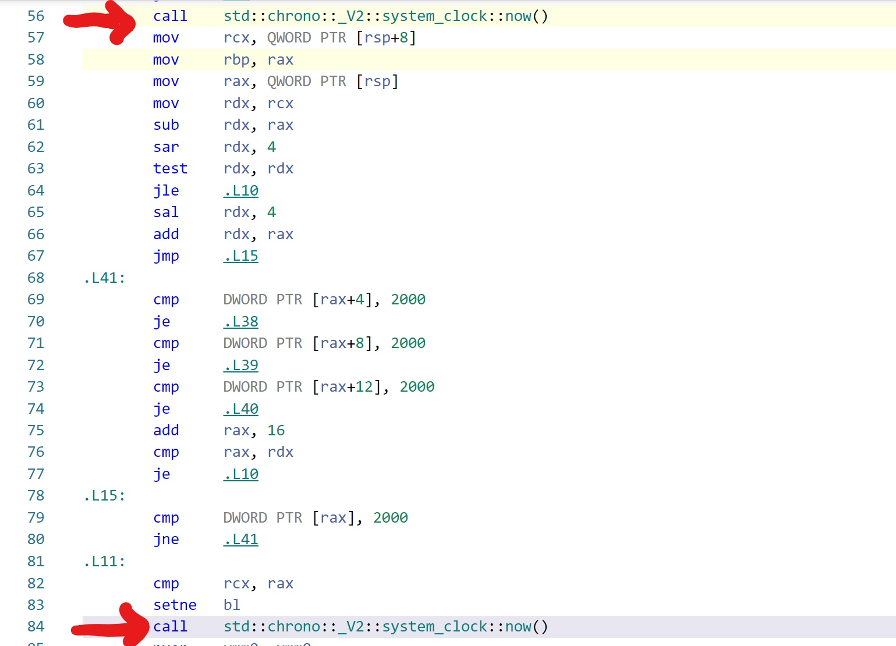

# Multithreading in  C++. Part 1.
Starting with the C++11 standard, C++ provides support for writing _portable_ multitheaded applications without relying on additional libraries and extensions. The basic functions and classes for thread support are declared in the ```<thread>``` header. Check the definition  [here](https://en.cppreference.com/w/cpp/thread/thread).
We introduce threads with the ubiquitous hello thread program.
# Creating threads

Starting a new thead in C++ is done by constructing a new ```std::thread``` object. Thread execution begins __immediately__ after the ```thread``` object is constructed. A simple example,

```cpp
#include <iostream>
#include <thread>

// every thread has an "entry" function
void hello() {
    std::cout << "hello thread\n";
}
int main()
{
    std::thread t(hello);
    t.join();
    return 0;
}

```

Thread execution starts at the __entry__ or __top level__ function passed as an argument to the thread object constructor. In the example above the __entry__ or __top level__ function is ```hello()```. 
Since the return value of the __top level__ function is ignore it is usually returns void. 
The Note that the program now has __two__ threads, the initial one running ```main()``` and the one we have created. The call to ```join()``` is important, otherwise the main thread could finish before the thread ```t```.
Note that we can choose ```detach()``` instead of ```join()```. In this case the thread would continue even after the main thread finished. In either case, we need to choose one of the two options, otherwise when the thread destructor is called it terminates our program. Almost in all use cases we use ```join()```.


# Function Objects and Lambdas

In addition to functions, threads can be passed function objects or lambdas as parameters. For example

```cpp
#include <iostream>
#include <thread>
struct bg_task{

   void operator() (){
     std::cout<<"function object \n";
   }
};

int main(){
    std::thread a(bg_task{});
    std::thread b([](){
        std::cout<<"calling lambda\n";
    });
a.join();
b.join();

}
```
You can try this simple example [here](https://godbolt.org/z/b3TcYe). Note that when using gcc we need to pass the pthread switch.

So far we have used ```std::thread::join``` which we use almost exclusively. The example below is an illustration of the use of ```detach```.

```cpp
#include <iostream>
#include <thread>
#include <fstream>

#define WAIT

void write_to_file() {
	std::ofstream output;
	output.open("output.txt");
	output << "first line\n";
	output << "second line\n";
	output.close();
}
int main()
{
	std::thread t{ write_to_file };
	t.detach();
#ifdef WAIT
	std::this_thread::sleep_for(std::chrono::minutes(1));
#endif
}
```
As you can see we use ```detach()``` instead of ```join()```. Therefore the calling thread (in this case main) does not wait for the thread ```t```. But when the main thread exists all other threads are destroyed. Therefore the created thread might not have enough time to perform its job. You can see these two cases by defining and undefining  __WAIT__ in the code.

# In class exercise 0
Write two function, each running in its own thead. The first ```read_input``` keeps reading input from ```std::cin``` until the user types "quit". The second one,```read_file``` reads the content of (a one line) file. To simulate a time consuming I/O operations the ```read_file``` function should sleep for 10 seconds.
Create a text file in the same directory as your VC++ solution, call it "input.txt" and write a one liner in it.
```cpp

#include <iostream>
#include <fstream>
#include <thread>
#include <chrono>
void read_input() {
    std::string s;
    std::cout << "enter a string. Type 'quit' to quit\n";
    while (s != "quit") {
        std::cin >> s;
        std::cout << "user input= " << s << "\n";

    }
}
void read_file(std::string name) {
    std::ifstream file;
    std::string content;
    std::this_thread::sleep_for(std::chrono::seconds(10));
    file.open(name);
    std::getline(file, content);
    std::cout << "content of file =" << content << "\n";
    file.close();
}
int main()
{
    std::thread t(read_file,"input.txt");
    std::thread t2(read_input);
    t.join();
    t2.join();
    std::cout << "main thread done\n";
}


```
# Handling exceptions
We close this section by considering the case when an __exception__ is thrown before a thread is joined. Consider the following code

```cpp
#include <iostream>
#include <thread>
#include <exception>
void myf(){
    throw std::exception{};
}
void runt(){
    std::thread t([](){std::cout<<"started thread\n";});
    myf();
    t.join();

}
int main(){
    try {
        runt();
    }
    catch(std::exception e){
        std::cout<<e.what()<<"\n";
    }
    std::cout<<"main thread is done\n";
}
```
Try running this code [here](https://godbolt.org/z/K3a96M).
As you can see the statement ```std::cout<<"main thread is done\n"``` is never reached. This is because when the destructor of a thread object is called (i.e. ~std::thread()) it calls ```std::terminate()``` __if__ the thread is __joinable__. Calling ```std::thread::join()``` or ```std::thread::detach()``` make the thread __not joinable__ and therefore does not call ```std::terminate()```.

In the above example, ```t.join()``` is never reached because ```myf()``` throws an exception. Therefore  ```t.~thread()``` calls ```std::terminate()```.
One way to guard against such a situation to use the _Resource acquisition is initialization_ (RAII) technique. We will see more of this technique when we study mutexes and locks but for now it is sufficient to say that we construct an object wrapper around the thread so that it automatically calls ```join()``` when it is destroyed.

In the code below we define a class ```thread_guard``` that __automatically__ calls ```join``` when its destructor is called. Since the destructor is called when the object goes out of scope this guarantees that the created thread will be joined even when the scope that created the thread takes an unexpected flow due to exceptions.

```cpp
#include <iostream>
#include <exception>
#include <thread>
void threadf() {}
void throwf() {
    std::cout << "starting throwf\n";
    throw std::exception{  };
}
struct thread_guard {
    std::thread& _t;

    thread_guard(std::thread& t) :_t(t) { }
    ~thread_guard() {
        if(_t.joinable())
            _t.join();
        std::cout << "thread guard dtor\n";
    }
};
void runt() {
    std::thread t(threadf);
    thread_guard g(t);
    throwf();
}
int main()
{
    try {
        runt();
    }
    catch (std::exception & e) {
        std::cout<<e.what()<<"\n";
    }
    std::cout << "main thread is done\n";
}
```
You can try the above code [here](https://godbolt.org/z/8MG91T)

Our solution __does not__ guard against the case when an exception occurs __inside__ the thread code. In the previous example if the thread _t_ runs function ```throwf``` instead of ```threadf``` our thread_guard solution does not work. This is because exceptions __are not__ transferred between threads so we need to handle it locally. One solution is to provide an exception safe wrapper as in the example below.

```cpp
#include <iostream>
#include <exception>
#include <thread>
void threadf() {}
void throwf() {
    std::cout << "starting throwf\n";
    throw std::exception{  };
}
struct thread_guard {
    std::thread& _t;

    thread_guard(std::thread& t) :_t(t) { }
    ~thread_guard() {
        if(_t.joinable())
            _t.join();
        std::cout << "thread guard dtor\n";
    }
};
void runt() {
    std::thread t(throwf);
    thread_guard g(t);
    throwf();
}
template<typename F>
void wrapper(F f){
   try{
       f();
   }
   catch(...){}
}
int main()
{
    std::thread t(wrapper<void (*)()>,throwf);
    t.join();
    std::cout << "main thread is done\n";
}
```
You can try the code [here](https://godbolt.org/z/Gqbvvj).

In this case the compiler can not automatically deduce the template parameter type ```F``` because we are calling ```wrapper``` indirectly inside a thread object. Compare that with just calling from main ```wrapper(throwf)``` which the compiler can automatically deduce.

If passing the type of ```throwf``` to the template looks complicated you can use ```decltype```, i.e.
```std::thread t(wrapper<decltype(throwf)>,throwf)```


# Passing parameters

Passing arguments to the function is done by passing extra arguments to the thread constructor.
For example,

```cpp
#include <iostream>
#include <thread>
struct fobj{
    void operator()(std::string s){
        std::cout<<s<<"\n";
    }
};
void threadf(std::string s){
    std::cout<<s<<std::endl;
}
int main(){
    int x=0;
    std::thread q(fobj{},"Hello function object");
    std::thread p([](std::string s){
        std::cout<<s<<"\n";
        },"Hello lambda");
    std::thread t(threadf,"hello function");
    p.join();
    q.join();
    t.join();
}
```
You can try the above code [here](https://godbolt.org/z/oTaYxn).

Internally, the thread constructor passes arguments to the callable object as an __rvalue__. 
 Therefore if the callable object expects the argument to be a reference then use ```std::ref```.

The code below will not compile
```cpp
#include <iostream>
#include <thread>
void threadf(int& x){
    x=17;
}
int main(){
    int x=2;
    std::thread t(threadf,x);
    t.join();
    std::cout<<x<<std::endl;
}
```
But this one does, __note__ the use of ```std::ref```.

```cpp
#include <iostream>
#include <thread>
void threadf(int& x){
    x=17;
}
int main(){
    int x=2;
    std::thread t(threadf,std::ref(x));
    t.join();
    std::cout<<x<<std::endl;
}
```
Try it [here](https://godbolt.org/z/63aWsb).

The situation is similar to the following example:
```cpp
void func(int &x){

}
template<typename T,typename U>
void g(T f,U&& x){
    f(std::move(x));
}
int main(){
    int x=17;
    g(func,x);
}
```
You can try it [here](https://godbolt.org/z/Mv9ddq).


A different way of passing parameters by reference would be to use a function object that stores a reference to the variable.
Example

```cpp
#include <thread>
#include <iostream>
struct foo {
	int& _x;
	foo(int& x) :_x(x) {}
	void operator()() {
		_x = 19;
	}
};
int main(){
    int x=8;
    std::thread t(foo{x});
    t.join();
    std::cout<<x<<"\n";
}
```
# In class exercise 1

In this exercise we use two threads to generate  two large random prime numbers.
We compare the performance with a sequential version where the generator is called twice in a row.

First we write the random number generator and the selection of primes
```cpp
#include <iostream>
#include <thread>
#include <random>
/* a simple function to sample large random numbers */
std::random_device rd;
const int lowest=4000000;
const int highest=8000000;
std::uniform_int_distribution<int> dist(lowest, highest);
inline int get_rand() {
    return dist(rd);
}

bool is_prime(int value) {
      /* this is NOT the most efficient way of
      * determining if a number is prime */
    if (value <= 1)return true;
    
    for (int i = 2; i < value; ++i) 
        if (value % i == 0) return false;
    
    return true;
}

```

The above allows us to generate a random number between _lowest_ and _highest_ then test if it is a prime number. Note that ```is_prime()``` is __not__ the most efficient way of testing a prime. In any case we prefer this so that each thread has sufficiently large computations to perform.

To have enough probability to select a prime we repeat the above _n_ times until we find a prime number as shown below.

```cpp
/* A function that samples random numbers until it finds a prime.
* Gives up and returns 0 after n tries
*/
int get_large_prime(int n) {
    int large;
    for (int i = 0; i < n; ++i) {
        large = get_rand();
        if (is_prime(large))return large;
    }
    return 0;
}
```

We call the above code twice, sequentially, and measure the duration.
```cpp
int main(){
    const int num_tries = 300;
    auto start = std::chrono::high_resolution_clock::now();
    int v1,v2;
    std::cout << "starting sequential\n";
    v1=get_large_prime(num_tries);
    v2 = get_large_prime(num_tries);
    auto end = std::chrono::high_resolution_clock::now();
    auto duration = std::chrono::duration<double, std::ratio<1, 1000>>(end - start);
    std::cout << "values found " << v1 << " and " << v2 << std::endl;
    std::cout << "sequential time = " << duration.count() << std::endl;
}
```
On an i7 this takes about 26 milliseconds.

To perform the two operations in parallel, since we have multiple cores, we run ```get_large_prime``` in two separate threads. Since a ```std::thread``` object ignores the return value of the top level function we must pass a variable by reference to retrieve the prime number. Therefore we overload ```get_large_prime``` as follows:
```cpp
/* to be used with threads */
void get_large_prime(int n,int& result) {
    int large;
    result=0;
    for (int i = 0; i < n; ++i) {
        large = get_rand();
        if (is_prime(large)){
            result=large;
            return ;
        }
    }
    return ;
}

```
And the main function
```cpp
int main(){
    const int num_tries = 300;
    auto start = std::chrono::high_resolution_clock::now();
    int v1,v2;
    
    std::cout << " starting two threads \n";
    auto start = std::chrono::high_resolution_clock::now();
    /* start two threads here and call the
    * the function you wrote to get a large prime
    */
   
    std::thread t1(get_large_prime,num_tries, std::ref(v1));
    std::thread t2(get_large_prime,num_tries, std::ref(v2));
    t1.join(); t2.join();
    auto end = std::chrono::high_resolution_clock::now();
    auto duration = std::chrono::duration<double, std::ratio<1, 1000>>(end - start);
    std::cout << "values found " << v1 << " and " << v2 << std::endl;
    std::cout << "two threads time = " << duration.count() << std::endl;
    }
```
Unfortunately, with threads the compiler doesn't know which version to use. You can try the above [here] (https://godbolt.org/z/jWhjqK) to see the error.

The simplest solution is to give a different name for the two versions. A different way is to help the compiler which allows us to use the same name.
```cpp
...
 using FType = void (*)(int, int&);
 FType f = get_large_prime;
 std::thread t1(f,num_tries, std::ref(v1));
 std::thread t2(f),num_tries, std::ref(v2));
 ...
```
You can try this solution [here](https://godbolt.org/z/sadPTj).

# Transferring thread ownership

Sometimes we need to transfer ownership of thread. For example, we we need to store threads in containers. But thread objects are __not copyable__. Only one thread object can be associated with a thread of execution at any given time. In these cases we must use __move semantics__.
Here an example to illustrate the problem. For simplicity we define a ```Container``` class that holds a single item. Typically, a container would add a __copy__ of an object of arbitrary type which does not work with threads. 
```cpp
#include <iostream>
#include <thread>

void threadf() {}

template<typename T>
struct Container {
	T _t;
	Container() {
		std::cout << "general\n";
	}
	void addItem(const T& t) {
		_t = t;
	}
	T& getItem() {
		return _t;
	}
};
struct Tclass{
};

int main() {

	std::thread t(threadf);
	Tclass obj;
	Container<std::thread> tc;
	Container<Tclass> oc;
	tc.addItem(t);
	oc.addItem(obj);
	
	tc.getItem().join();
	std::cout << "main thread is done\n";
}
```

If you run the above code [here](https://godbolt.org/z/7TMvWT) the compiler will give an error similar to "use of deleted function operator=" because it is deleted for ```std::tread``` objects.
One solution would be to __specialize__ the template for ```Container```, i.e. add the following code
```cpp
template<>
struct Container<std::thread> {
	std::thread _t;
	Container() {
		std::cout << "specialized\n";
	}
	void addItem(std::thread& t) {
		_t = std::move(t);
		
	}
	std::thread & getItem() {
		return _t;
	}
	
};
```
As you can see the ```addItem``` method uses ```std::move``` when ```T=std::thread```.
A better method which is used by STL containers is to have two versions of ```addItem```: one that takes a constant reference and the other an rvalue reference as show in the code below.
```cpp
#include <iostream>
#include <thread>

void threadf() {
}

template<typename T>
struct Container {
	T _t;
	void addItem(T& t) {
		_t = t;
	}
	void addItem(T&& t) {
		_t = std::move(t);
	}
	T& getItem() {
		return _t;
	}
};
struct Tclass{
};

int main() {

	std::thread t(threadf);
	Tclass obj;
	Container<std::thread> tc;
	Container<Tclass> oc;

	tc.addItem(std::move(t));
	oc.addItem(obj);
	
	tc.getItem().join();
	std::cout << "main thread is done\n";
}
```
You can test the code [here](https://godbolt.org/z/EsEWb7)


# In class exercise 2 (Note on compiler optimization)

In many of the examples we compare the performance of single vs multi threaded versions. Since our focus is on performance we don't use the result of the single threaded version unless we need to check the correctness of the multi-threaded version.

This approach sometimes leads to surprising results because of __compiler optimizations__. In particular, __dead code elimination__.
The basic idea is that if a variable or the output of a function is not used, the compiler might not include the function in the executable. In that case the duration of the function call is (close to) zero.

Let us illustrate with an example of sequential code.

```cpp
#include <iostream>
#include <vector>
#include <random>
#include <algorithm>
#include <chrono>

int main(){
    std::random_device rd;
    std::uniform_int_distribution<int> dist(1,1000);
    const int n=5000000;
    std::vector<int> v(n);
    std::generate(v.begin(),v.end(),[&](){return dist(rd);});
    auto start=std::chrono::high_resolution_clock::now();
    bool result=std::any_of(v.begin(),v.end(),
            [](int x){return x==2000;}
            );
    auto end=std::chrono::high_resolution_clock::now();
    auto duration=
        std::chrono::duration<double,std::milli>(end-start);
    std::cout<<"duration = "<<duration.count()<<"\n";
    std::cout<<"value found ="<<std::boolalpha<<result<<"\n";
}
```
You can try the above code [here](https://godbolt.org/z/voTvna)
The duration is either close to zero or about 2.3 milliseconds depending on if
we remove the last line that prints the value of ```result``` or not.

The reason is that when we don't print (i.e. not use) the variable result the compiler removes it from the code. This can be seen below in the assembly output between the two calls to ```now()```.




Figure 1  shows the assembly output when the last line __is not included__. Note the absence of instructions between the two calls to ```now()```.


Figure 2  shows the assembly output when the last line __is included__. Note the number of instructions between the two calls to ```now()```.


# In class exercise 3

In this exercise we will build a multi-threaded program to determine if a large vector of integers contains a certain value.

This is the parallel version of STL ```std::any_of```( we will see later that STL algorithms can also be parallelized easily)

The basic idea is to divide the range into as many blocks  as there are hardware threads. For each block, a thread, independently, searches that block for the value.
When all the threads are done, if any of them as found a value in its own block we conclude that the vector contains that value.
To collect the results of threads we define ```std::vector<bool> results(num_threads)```. thread _i_, will store its result in ```results[i]```.

The function ```contains``` takes a starting and ending iterators denoting a particular block of the vector. The reason we use a bool iterator for the ```results``` instead of, say, passing ```result[i]``` by reference is that the implementation of ```std::vector<bool>``` is a specialization of ```std::vector```. In particular ```operator[]``` returns a value __not__ a reference like the general implementation. 

In the example below we search for a non-existent value to maximize the running time.


```cpp
/* Given a vector v of n integers:
* Write a function to test if v  
* contains a certain number at least once.
* Use as many threads as your hardware permits.
*/

#include <iostream>
#include <thread>
#include <vector>
#include <chrono>
#include <random>
#include <algorithm>

template<typename T>
void print_duration(T start, T end,std::string s) {
    auto duration = std::chrono::duration<double, std::ratio<1, 1000>>(end - start);
    std::cout << "\nduration "<<s <<" "<< duration.count() << "\n";
}
/* note that the range is
* a semi closed interval [first,last)
*/

template<typename Iter,typename T,typename IterBool> 
void contains(Iter first, Iter last, T value,IterBool result);

/* see the lecture notes for the reason we use
* an iterator for the bool instead of passing a bool
* variable by reference
*/
template<typename Iter,typename T,typename IterBool>
void contains(Iter first, Iter last, T value,IterBool result) {
	Iter itr = first;
	*result = false;
	while (itr != last) {
		if (*itr == value) {
			*result = true;
			return;
		}
		++itr;
	}
	return ;
}

int main()
{
	/* choose size power of two */
	const int n = 2 << 25;
	std::random_device rd;
	std::uniform_int_distribution<int> dist(1, 10000);
	/* choosing a value that is NOT in the vector*/
	int value = 12000;


	std::vector<int> v(n);
	std::generate(v.begin(), v.end(), [&]() {return dist(rd); });
	using Iter = std::vector<int>::iterator;
	/* using the sequential STL std::any_of() */
	auto start = std::chrono::high_resolution_clock::now();
	bool res = std::any_of(v.begin(), v.end(), [=](int x) {return x == value; });
	std::cout << "sequential result = " << std::boolalpha << res << std::endl;
	auto end = std::chrono::high_resolution_clock::now();
	print_duration(start, end, "sequential ");

	/* Using our implementation with the number of
	* threads equal to the hardware threads
	*/
	int num_threads = std::thread::hardware_concurrency();
	int block_size = n / num_threads;
	/* store the result of each block in vector results */
	std::vector<bool> results(num_threads);
	std::vector<std::thread> mythreads;
	Iter begin = v.begin();
	auto itr = results.begin();
	start = std::chrono::high_resolution_clock::now();
	/* declaring i as long long to avoid warning
	* when we use it for iterator arithmetics
	* since iterators on x64 are 8 bytes
	*/
	/* divide the input into blocks equal to the
	* number of threads
	*/
	for (long long i = 0; i < num_threads; ++i) {
		/* we can do such arithmetic because
		* vector iterators are random iterators
		*/
		Iter first = begin + i * block_size;
		Iter last = begin + (i + 1) * block_size;
		mythreads.push_back(
			std::thread(
				contains<Iter, int, decltype(itr)>, first, last, value, itr)
		);
		++itr;
	}
	for (auto& t : mythreads)
		t.join();
	end = std::chrono::high_resolution_clock::now();
	print_duration(start, end, "multiple threads");
	constexpr auto identity = [](auto r) {return r; };
	/* combine the results of blocks */
	std::cout<<"multiple thread result "<<
		std::any_of(results.begin(), results.end(),
			identity)<< "\n";
	
}
```
